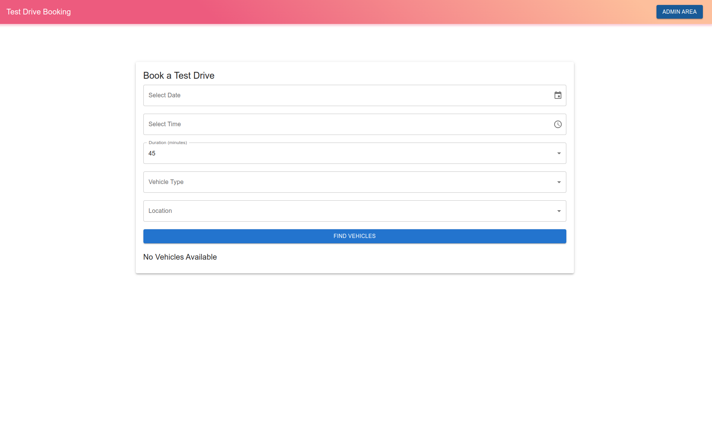
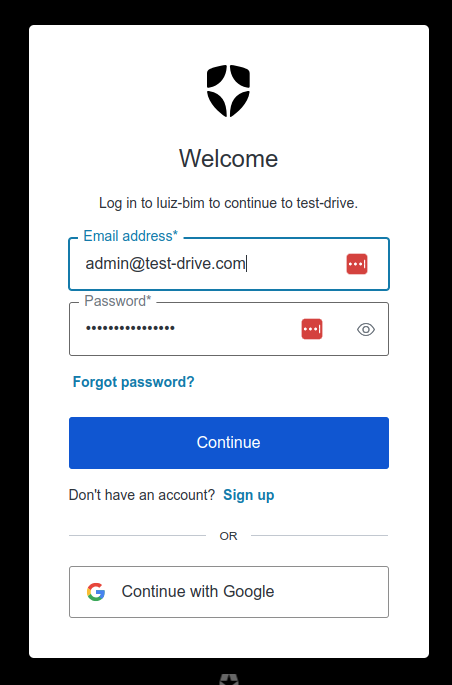
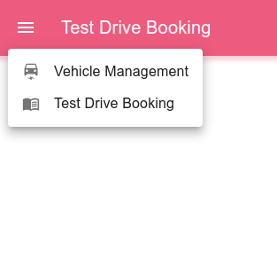
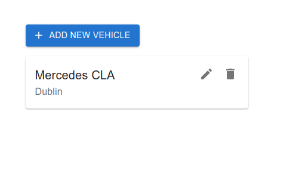

# TestDrive

This project showcases a subset of my fullstack abilities using NodeJS and ReactJS.

## Stack used

In this project I use a series of libraries, tools and frameworks to help me build the most consistent final product as possible. The repository main stack includes **NX Monorepo,** **NestJS, ReactJS, Postgres, Github Actions, Docker and Docker Compose**.

Below the reasons why choosing these technologies:

- **NX Monorepo:** NX monorepo is a great tool that help developers build consistent software stacks. It allows the developers to share code between frontend and backend, enforcing the maintainability of the project. Shared local build cache, ci automation, package management and dependency management are between the many functionalities that it brings out of the box.
- **NestJS:** A NodeJS, built in Typescript, web framework that provides an amazing toolbox for many types of projects. It relies in SOLID principles to help developers keep the quality and testability of the code.
- **ReactJS:** A market standard in frontend single page applications. It empowers the capabilites of reuse of components.
- **Postgres:** The database used for this project, very well stablished and reliable.
- **Github Actions:** The CI built in github tool that provides a perfect integration between your repository and the pipeline execution.
- **Docker & Docker Compose:** The containerization environment used to pack both applications into deployable applications.
- **Extra(Auth0):** I have added an integration with Auth0 to show how to integrate it with the frontend. _Not integrated with the backend yet_

## Requirements

- Docker version >= 26.1.1
- Docker Compose >= v2.27
- NodeJS >= v20.17.0
- NPM >= 10.8.2

## Running the application

#### Steps

1. Clone the Repo: `git clone git@github.com:luizbim/test-drive.git` OR `git clone https://github.com/luizbim/test-drive.git`
2. Move to inside the folder `cd test-drive`
3. Install all the dependencies `npm i`
4. Run the deployment script `./deploy-local`.sh
5. The application should start soon. You can access through http://localhost:4200

## Development mode

#### Setting up the stack

1. Clone the Repo: `git clone git@github.com:luizbim/test-drive.git` OR `git clone https://github.com/luizbim/test-drive.git`
2. Move to inside the folder `cd test-drive`
3. Install all the dependencies `npm i`
4. Start the local database using the docker compose `docker compose down && docker compose up -d`

#### Starting the Application

1. Start all apps using the nx target `nx run-many --all --target=serve`
2. The application should start soon with hot reload and debugger capabilities.
3. You can access through http://localhost:4200

#### Testing the application

1. Testing all the applications using nx target `nx run-many --all --target=unit-test`

#### Building the Application

This application use continuous integration to generate a new version of docker images for each app when a change is pushed to the main branch. If you desire to run the build manually you can follow the steps:

1. To build the NodeJS code you should use the nx target `nx run-many --all --target=build`
2. Then from the root folder run the docker build `docker buildx build -f ./apps/[project-path]/Dockerfile .` (Considering you have buildx installed and configured)

## Continuous Integration

Three pipelines have been configured to this repo.

1. PR Check - Checking the health of the PR that are created/updated
2. Auto Release - Detects the changes done using conventional commits to automatically bump versions
3. Auto Publish - Detects new github releases and create the docker images of the apps associated with the release

## The Application

The application consists of One frontend App written in ReactJS and one backend service written in NestJS

The frontend App Consists of two pages being one of them protected by authentication.

The public main page is the booking page



By clicking in Admin Area you will be redirected to the auth0 login page.


If you don't want to use your google account or create a new account, feel free to use a dummy user:

```

email: **admin@test-drive.com**
pass: **T0Ad$gN*30Z1xjSq**
```

After login you will be able to access the Vehicle CRUD operations on top left menu.



When clicking in Vehicle Management you will be able to list, add, edit and remove a vehicle.


